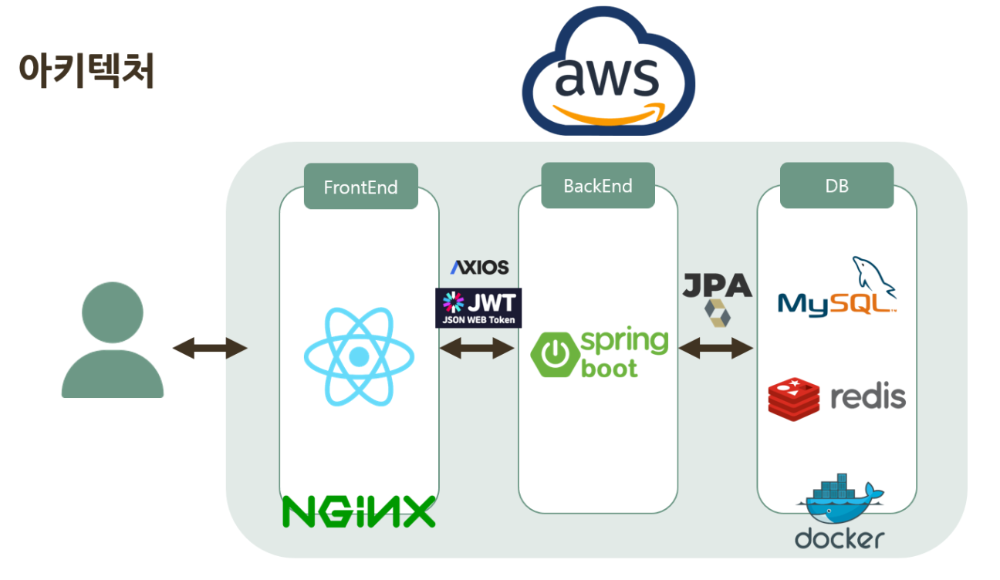
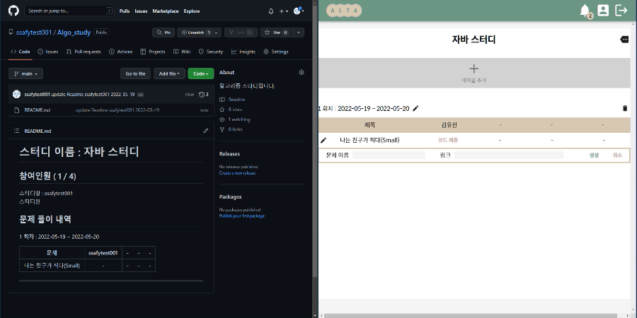
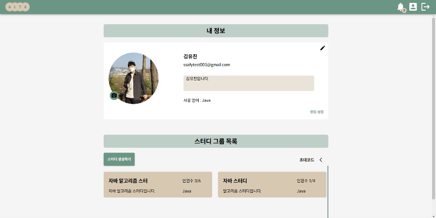
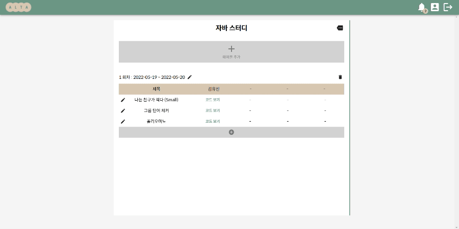
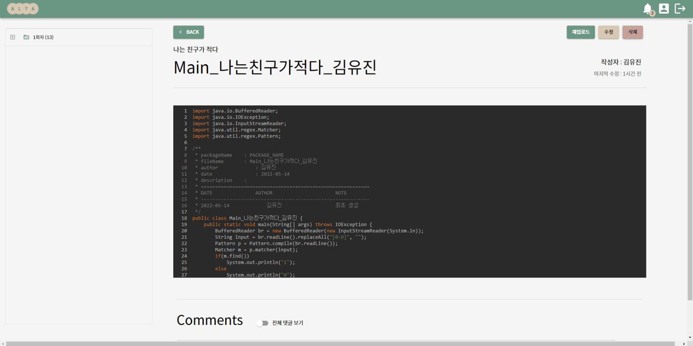
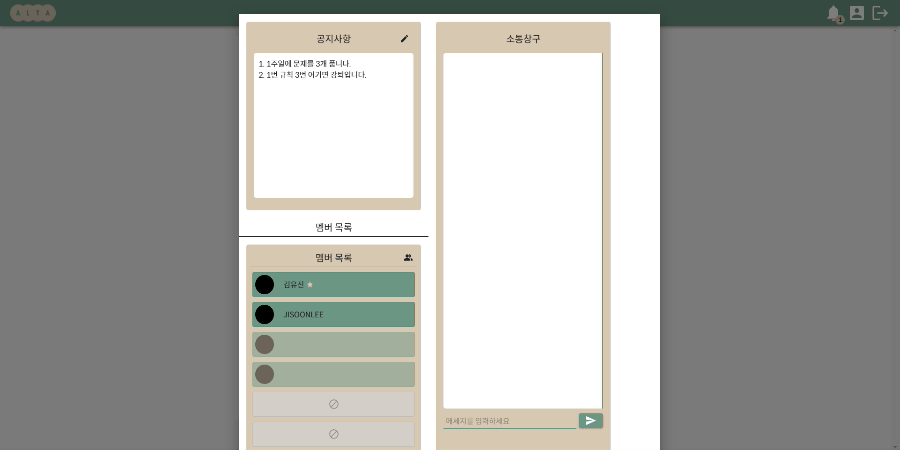

<div align="center">
  <br />
  
  <br />
</div>

## 목차

1. [**웹 서비스 소개**](#1)
1. [**개발 기간 및 일정**](#2)
1. [**기술 스택**](#3)
1. [**주요 기능**](#4)
1. [**서비스 아키텍처**](#5)
1. [**ALTA 서비스 화면**](#6)
1. [**개발 팀 소개**](#7)
1. [**와이어 프레임**](#8)
1. [**개체-관계 모델(ERD)**](#11)
1. [**실행 방법**](#13)

<br />

<div id="1"></div>

## 💁 웹 서비스 소개
---

**ALTA**는 알고리즘 스터디의 기록을 도와주는 서비스입니다.

레포지토리를 생성하고 관리하는 부분을 자동화하여 알고리즘 문제풀이에만 집중할 수 있도록 해줍니다.

[ALTA 이용해 보기](https://algorithmtime.com)

<br />

> 서비스를 이용하려면 Github 계정이 있어야 하며, 연동을 필요로 합니다.

<br />

<div id="2"></div>

## 📅 개발 기간
---
2022.04.18 ~ 2022.05.20

<br />

<div id="3"></div>

## 🛠 기술 스택
---
### **Front-end**

|  |  |  |  |
| :----------------------------------------------------------------------------------------------------------------------------: | :--------------------------------------------------------------------------------------------------------------------------: |:---------------------------------------------------------------------------------------------------------------------------------:|:----------------------------------------------------------------------------------:|
|                                                             HTML5                                                              |                                                             CSS3                                                             |                                                               React                                                               |                                        MUI                                         |                                                                              Web3.js                                                                              |

### **Back-end**

|  |                                                                                                                                                             |  |
| :--------------------------------------------------------------------------------------------------------------------------: |:----------------------------------------------------------------------------------------------------------------------------------------------------------------------------------------------------------------------------------------------------------------------------------------------------------:|  :----------------------------------------------------------------------------------------------------------------------------: |
|                                                             Java                                                             |                                                                                                               Spring-Boot                                                                                                                                                                                  |                                                             MySQL                                                              |


### **DevOps**

|  |  |  |  |
| :-------------------------------------------------------------------------------------------------------------------: | :------------------------------------------------------------------------------------------------------------------------------: | :-----------------------------------------------------------------------------------------------------------------------------------------------------------: | :------------------------------------------------------------------------------------------------------------------------------: |
|                                                         NGiNX                                                         |                                                               aws                                                                |                                                                            Jenkins                                                                            |                                                              docker                                                              |

<br />

<div id="4"></div>

## 💡 주요 기능
---
- Git 연동
- Git Repository 연동 후 README 자동 업데이트
- Git Repository 파일 업로드
- 코드 리뷰를 위한 커뮤니케이션 기능

<br />

<div id="5"></div>

## 📂 서비스 아키텍처
---


<br />

<div id="6"></div>

## 🎥 ALTA 서비스 화면
---

|                                            |                                                |
|--------------------------------------------|------------------------------------------------|
| Repo 생성                                    | readme 자동 업데이트                                 |
|       |  |
| 문제 및 회차 생성                                 | 문제 및 회차 삭제                                     |
|      |         |
| 알림                                         | 코드 업로드                                         |
|      |    |
| 코드 트리                                      | 라인 별 코멘트 작성                                    |
|  |   |
| 채팅 기능                                      |                                                |
|       |                                                |


<br />

<div id="7"></div>

## 👪 개발 팀 소개
---


<br />

| 이름  |        역할        | <div align="center">개발 내용</div>                                                                                                                          |
|:---:|:----------------:|:---------------------------------------------------------------------------------------------------------------------------------------------------------|
| 김유진 | Back-end<br />팀장 | 유저 데이터 관리 API <br /> Github API 통신 <br /> CI/CD <br /> 배포 <br /> 데이터 베이스 설계                                                                                        |
| 오서하 |     Back-end     | Github 소셜 로그인 <br /> JWT 토큰 기능 개발 <br /> Refresh Token 기능 개발 <br /> Redis 캐시 서버  <br /> 데이터 베이스 설계                                                                        |
| 우정연 |     Back-end     | 코드 업로드 <br /> 코멘트 작성 <br /> 알림 기능 <br /> 일정 관리 <br /> Github API 통신 <br /> 데이터 베이스 설계                                                                                     |
| 윤지영 |    Front-end     | UI/UX 설계 <br /> 코드 상세 페이지 조작 기능 <br /> 채팅 기능 <br /> 알림 기능 <br /> 코드 데이터 상태 관리 <br /> 스터디 참여 인원 관리 기능 <br /> SEO 최적화                                      |
| 이주현 |     Front-end     | UI/UX 설계 <br /> 로그인 및 로그인 만료 처리 기능 <br /> 유저 데이터 상태 관리 <br /> 스터디 데이터 상태 관리 <br /> 스터디 생성 기능 <br /> 스터디 상세 페이지 조작 기능 <br /> 성능 개선 <br />  SEO 최적화 <br /> |
| 이지순 |     Back-end     | 스터디 상세 페이지 조작 API <br /> 메일링 시스템 <br /> 소켓 통신(채팅) <br /> Github API 통신 <br /> 데이터 베이스 설계                                                                 |

<br />

<div id='8'></div>

## 🎨 와이어 프레임
---


<br />

## 📐 개체-관계 모델(ERD)
---


<br />
<div id='13'></div>

## 💻 실행 방법
---
### Front-end
```bash
git clone [레포지토리]

cd front

npm install

npm run start
```

<br />

### Back-end
```bash
./gradlew build

java -jar {application이름}.jar
```
